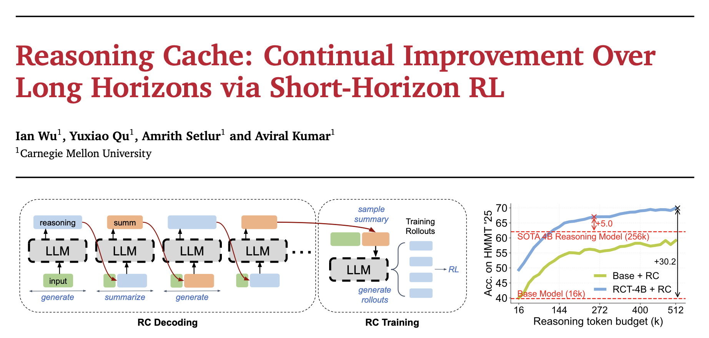

# Reasoning Cache

This codebase accompanies our research paper: "Reasoning Cache: Continual Improvement Over Long Horizons via Short-Horizon RL (2026)."

For inference-only (`RC`-decoding) code, please see `inference` (vLLM only).

For training code, please see `training` (verl required).

## Artefacts

`RCT-4B`: `HerrHruby/offline_acemath_rl_4b_inst_hard_with_dishsoap_16k_no_summ_curr_step_120`

Stage I Training Set: `HerrHruby/acemath_rl_4b_inst_hard`

Stage II Training Set: `HerrHruby/acemath_rl_4b_inst_hard_with_dishsoap`
