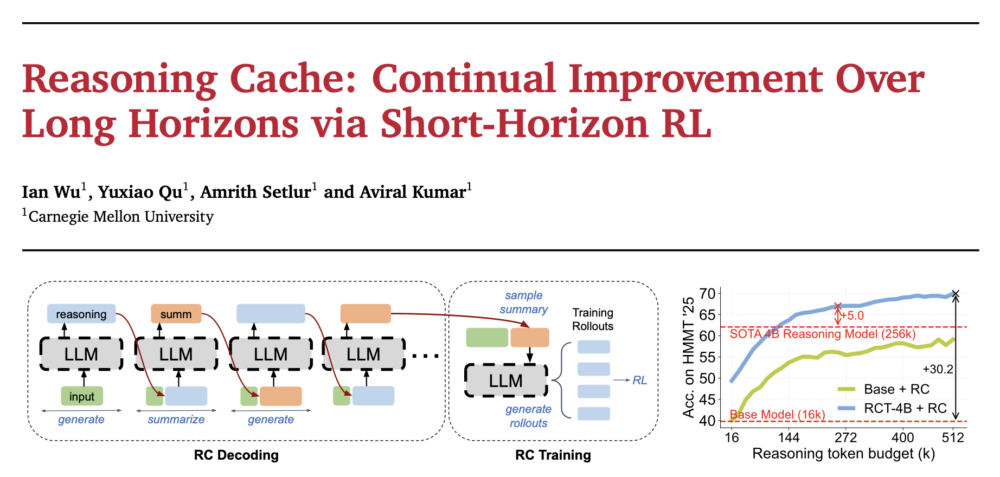

# Reasoning Cache

This codebase accompanies our research paper: "Reasoning Cache: Continual Improvement Over Long Horizons via Short-Horizon RL (2026)."

For inference-only (`RC`-decoding) code, please see `inference` (vLLM only).

For training code, please see `training` (verl required).

## Artefacts

`RCT-4B`: `HerrHruby/RCT-4B`

Stage I Training Set: `HerrHruby/RCT-4B-RL-Stage-I`

Stage II Training Set: `HerrHruby/RCT-4B-RL-Stage-II`
